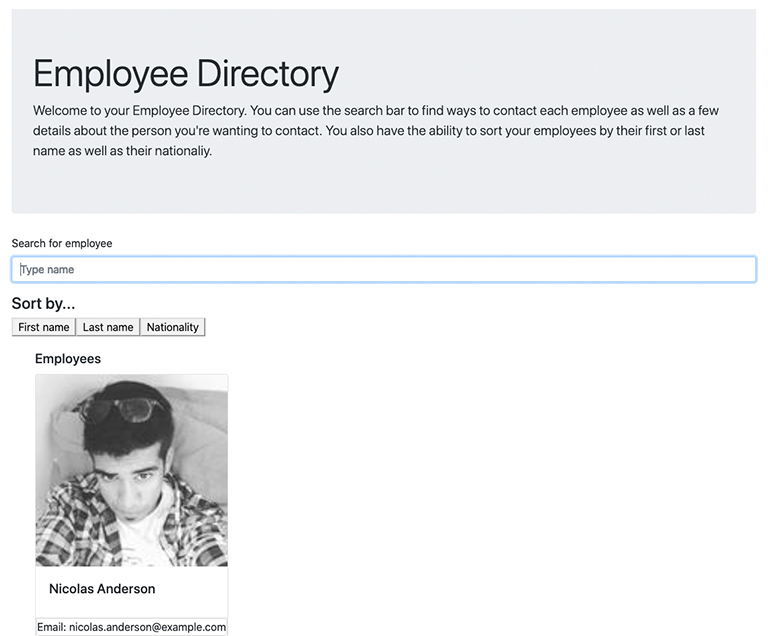

# [Employee Directory](https://employee-directory-jjh.herokuapp.com/)

    
    
    
    

    
    

## Application Descrition

This application lets any user search through an employee directory. This employee directory would let them find the contact information for the employee they are looking for. They can also sort the employees by first or last name as well as nationality.

## Application Demo

To watch a video of the application being fully demo'd please use this link: [Application Demo](...).

## Technologies Used

  
  
  
  
  
  
  

## Workflow

- delete first due to build errors; unexpected token ' ' bundle.js
- filters picked: last name, country. maybe registered "date".
- didn't push to github pages because....
- passed in two arrays because of "filter." A study group friend explained it to me how if you don't, you can't "go back" once you start to filter.
- issues with filter/sort. talked to study group member and he made me realize what i needed to do.
- deconstructing.
- table columns not right.

## Resources

[Shields.io](https://shields.io/)

[Screencastify](https://www.screencastify.com/)

My Study Group

- [Bryson](https://github.com/Bryson-Palmer)
- [Danny](https://github.com/DanZosh)
- [Ian](https://github.com/Ianaac27)
- [Thomas](https://github.com/Tskading)
- [Zac](https://github.com/themancalledzac)
